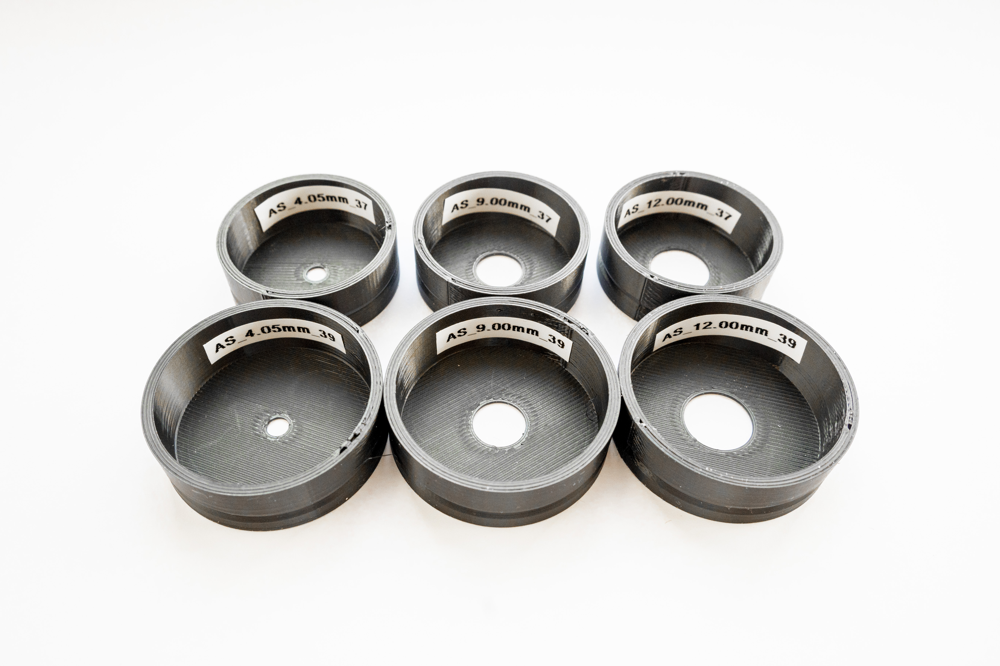

# LW_AS_ELWD

### The package contains six rings for **ELWD** condenser turret provided by Nikon

<!-- 
- **LW_AS_37_0405**
  - files for 3D print: [PDF](data/LW_AS_37_0405.pdf), [STL](data/LW_AS_37_0405.stl), [3MF](data/LW_AS_37_0405.3mf), [F3D](data/LW_AS_37_0405.f3d), [DXF](data/LW_AS_37_0405.dxf), [STEP](data/LW_AS_37_0405.step)
- **LW_AS_39_0405**
  - files for 3D print: [PDF](data/LW_AS_39_0405.pdf), [STL](data/LW_AS_39_0405.stl), [3MF](data/LW_AS_39_0405.3mf), [F3D](data/LW_AS_39_0405.f3d), [DXF](data/LW_AS_39_0405.dxf), [STEP](data/LW_AS_39_0405.step)
- **LW_AS_37_0940**
  - files for 3D print: [PDF](data/LW_AS_37_0940.pdf), [STL](data/LW_AS_37_0940.stl), [3MF](data/LW_AS_37_0940.3mf), [F3D](data/LW_AS_37_0940.f3d), [DXF](data/LW_AS_37_0940.dxf), [STEP](data/LW_AS_37_0940.step)
- **LW_AS_39_0940**
  - files for 3D print: [PDF](data/LW_AS_39_0940.pdf), [STL](data/LW_AS_39_0940.stl), [3MF](data/LW_AS_39_0940.3mf), [F3D](data/LW_AS_39_0940.f3d), [DXF](data/LW_AS_39_0940.dxf), [STEP](data/LW_AS_39_0940.step)
- **LW_AS_37_1200**
  - files for 3D print: [PDF](data/LW_AS_37_1200.pdf), [STL](data/LW_AS_37_1200.stl), [3MF](data/LW_AS_37_1200.3mf), [F3D](data/LW_AS_37_1200.f3d), [DXF](data/LW_AS_37_1200.dxf), [STEP](data/LW_AS_37_1200.step)
- **LW_AS_39_1200**
  - files for 3D print: [PDF](data/LW_AS_39_1200.pdf), [STL](data/LW_AS_39_1200.stl), [3MF](data/LW_AS_39_1200.3mf), [F3D](data/LW_AS_39_1200.f3d), [DXF](data/LW_AS_39_1200.dxf), [STEP](data/LW_AS_39_1200.step)

-->