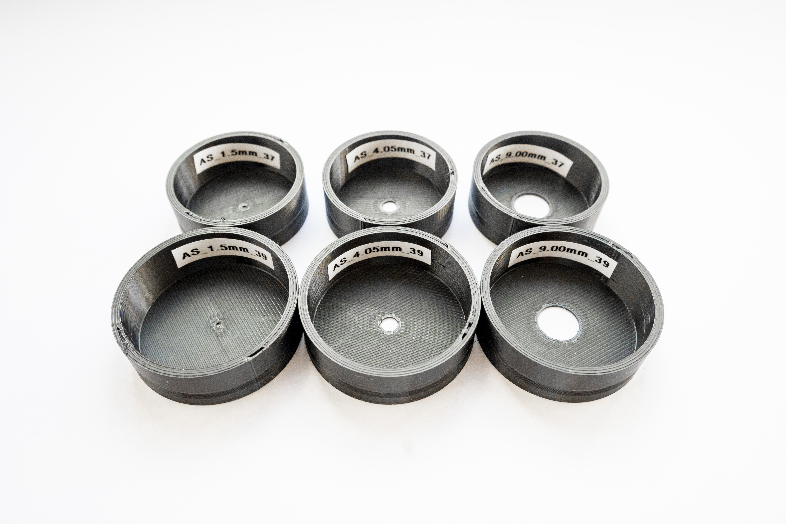

# LW_AS_LWD

### The package contains the following six rings for **LWD** condenser turret:

- **LW_AS_37_0150**
  - files for 3D print: [PDF](data/LW_AS_37_0150.pdf), [STL](data/LW_AS_37_0150.stl), [3MF](data/LW_AS_37_0150.3mf), [F3D](data/LW_AS_37_0150.f3d), [DXF](data/LW_AS_37_0150.dxf), [STEP](data/LW_AS_37_0150.step)
- **LW_AS_39_0150**
  - files for 3D print: [PDF](data/LW_AS_39_0150.pdf), [STL](data/LW_AS_39_0150.stl), [3MF](data/LW_AS_39_0150.3mf), [F3D](data/LW_AS_39_0150.f3d), [DXF](data/LW_AS_39_0150.dxf), [STEP](data/LW_AS_39_0150.step)
- **LW_AS_37_0405**
  - files for 3D print: [PDF](data/LW_AS_37_0405.pdf), [STL](data/LW_AS_37_0405.stl), [3MF](data/LW_AS_37_0405.3mf), [F3D](data/LW_AS_37_0405.f3d), [DXF](data/LW_AS_37_0405.dxf), [STEP](data/LW_AS_37_0405.step)
- **LW_AS_39_0405**
  - files for 3D print: [PDF](data/LW_AS_39_0405.pdf), [STL](data/LW_AS_39_0405.stl), [3MF](data/LW_AS_39_0405.3mf), [F3D](data/LW_AS_39_0405.f3d), [DXF](data/LW_AS_39_0405.dxf), [STEP](data/LW_AS_39_0405.step)
- **LW_AS_37_0940**
  - files for 3D print: [PDF](data/LW_AS_37_0940.pdf), [STL](data/LW_AS_37_0940.stl), [3MF](data/LW_AS_37_0940.3mf), [F3D](data/LW_AS_37_0940.f3d), [DXF](data/LW_AS_37_0940.dxf), [STEP](data/LW_AS_37_0940.step)
- **LW_AS_39_0940**
  - files for 3D print: [PDF](data/LW_AS_39_0940.pdf), [STL](data/LW_AS_39_0940.stl), [3MF](data/LW_AS_39_0940.3mf), [F3D](data/LW_AS_39_0940.f3d), [DXF](data/LW_AS_39_0940.dxf), [STEP](data/LW_AS_39_0940.step)

