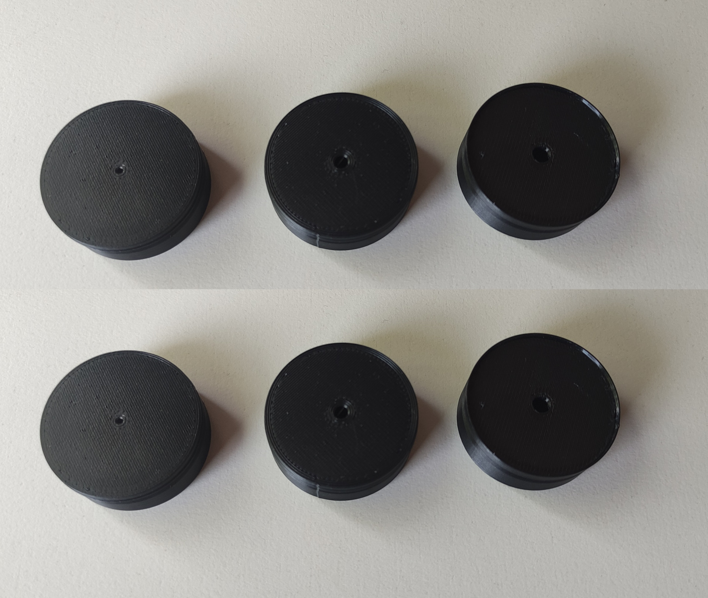

> [!WARNING]
> the page below is a preliminary version, it will be finished soon...

### The package contains the following rings for LWD Condenser Lens:

- **LW_AS_37_0150**
  - files for 3D print: [PDF](), [STL](), [3MF](), [F3D](), [DXF](), [STEP]()
- **LW_AS_39_0150**
  - files for 3D print: [PDF](), [STL](), [3MF](), [F3D](), [DXF](), [STEP]()
- **LW_AS_37_0405**
  - files for 3D print: [PDF](), [STL](), [3MF](), [F3D](), [DXF](), [STEP]()
- **LW_AS_39_0405**
  - files for 3D print: [PDF](), [STL](), [3MF](), [F3D](), [DXF](), [STEP]()
- **LW_AS_37_0940**
  - files for 3D print: [PDF](), [STL](), [3MF](), [F3D](), [DXF](), [STEP]()
- **LW_AS_39_0940**
  - files for 3D print: [PDF](), [STL](), [3MF](), [F3D](), [DXF](), [STEP]()

