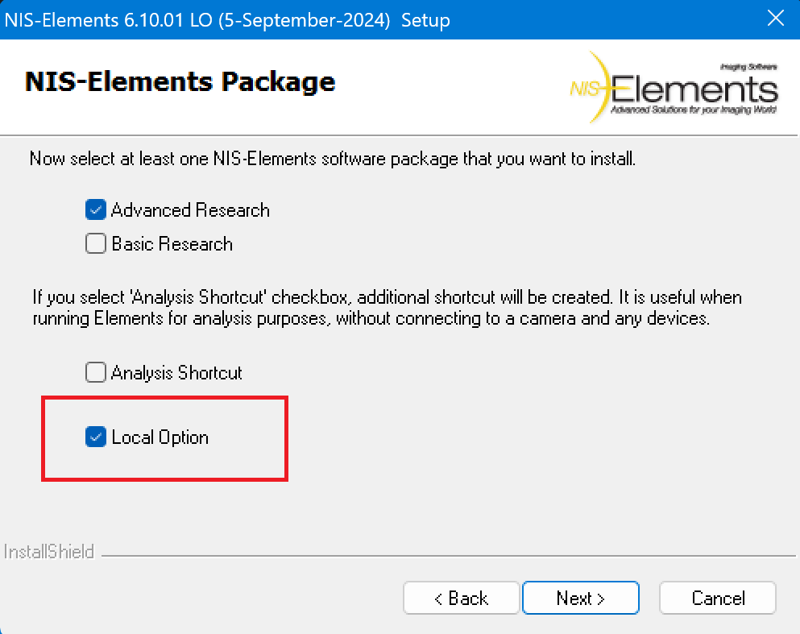
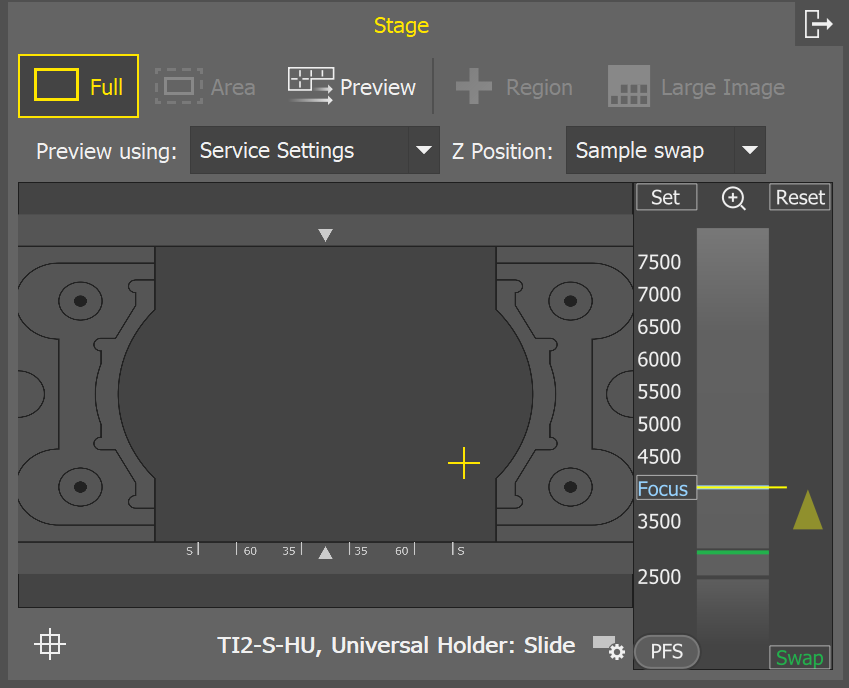
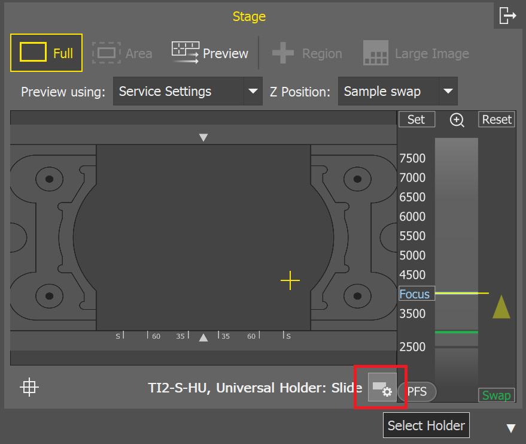
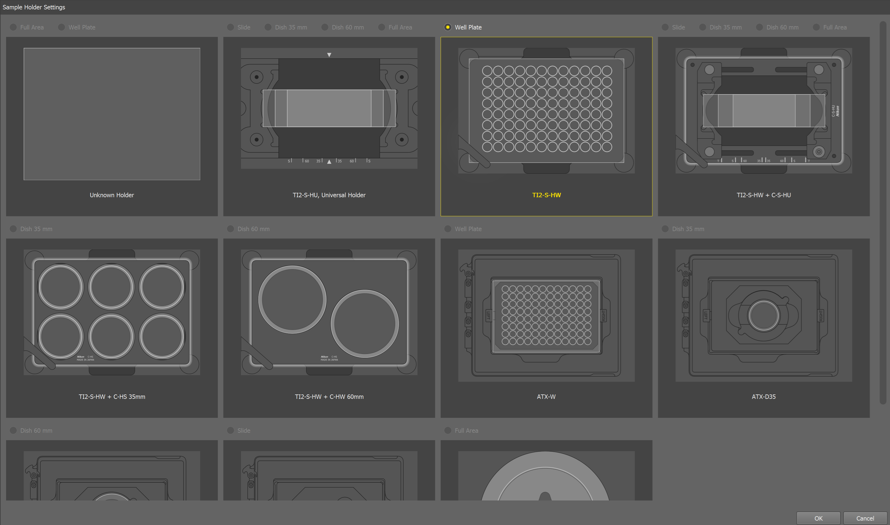
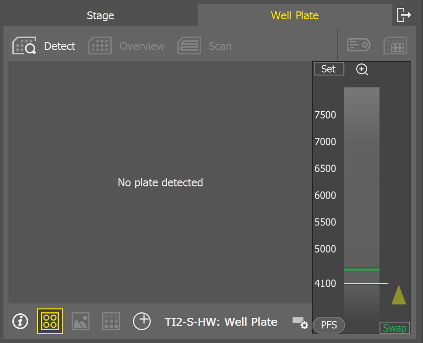
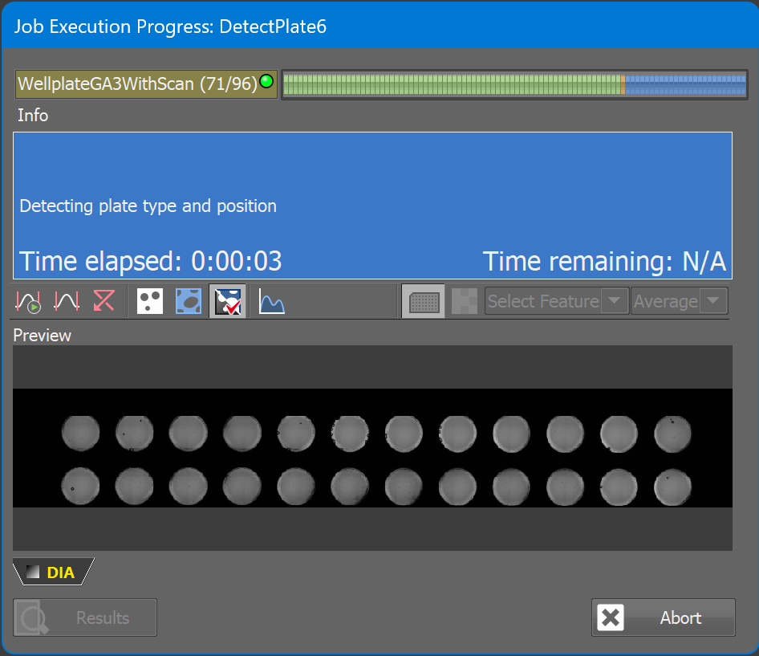
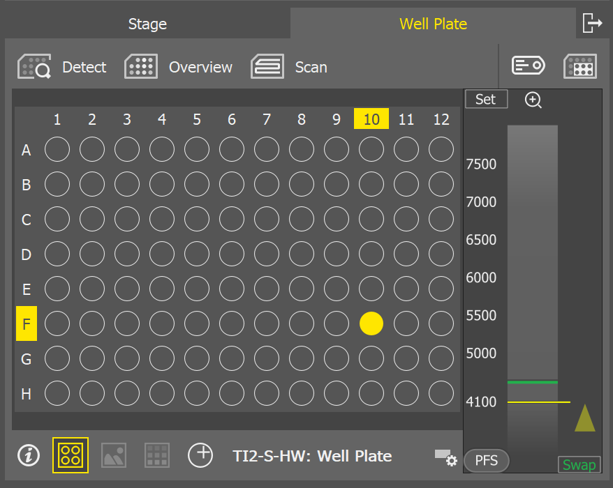

> [!WARNING]
> the page below is a preliminary version, it will be finished soon...

[\[Table of Contents\]](README.md)

# 2. Sample Navigation Control Panel usage

Please, make sure your NIS-Elements application is installed with Local Options.  

Some functions may not be visible/accessible if Local Options checkbox is unchecked.    

## 2.1 Holder Selection

- Sample Navigation displays the "Stage" tab only and a slide holder used for the calibration after closing "Service Settings" dialog window.  
  
- Change the holder/subholder to a wellplate holder on the microscope stage and put the wellplate into the wellplate holder.

- To let the NIS-Elements know the hardware configuration changed, click the button "Select Holder" and choose the appropriate wellplate holder and confirm it by clicking "OK" button.  

- Sample Navigation now displays not only Stage tab but also Wellplate tab saying "No plate detected".  
- Click the button "Detect" - system will use the previously defined Service Settings to detect the wellplate type.    
- Disabled functions becomes available once the wellplate is detected.  
  

Automatic detection algorithm recognizes the wellplate type and its position.  
  

When the wellplate is properly detected the schematic view is displayed and makes other functions available:  
- Overview - to scan the whole plate with 4x objective to get the real images into the navigation control panel  
- Scan - to perform the acquisition of the individual wells according to the well selection using current settings (objective, lighpath, etc.)  
- Label Wells - to define the labels and dosing (including positive/negative control and custom labels)  
- Select Wells - to perform the selection of the wells where the defined acquisition is performed using the "Scan" button  
- Move to Exact position - enables a user to move to the specified position on the stage (if disabled, it automatically moves to the center of the well)  
    

## 2.2 Overview  
Pressing the "Overview" button the wellplate is scanned using the configuration predefined in the "Service Settings" dialog (exposure, illumination, lightpath, etc.). Actually, it does not perform just the simple scanning but there are some phases to get the proper overview:  
1. Find Well phase - it goes through the wells and searches for the first well with some sample to run Auto Focus  
2. Scanning phase - it performs fast continuous scanning using the detected Z-position (the result of the previous phase with Auto Focus) 
3. Cell presence phase - it evaluates the cell presence (using built-in AI) and it is displayed as a label (in magenta color) to indicate the wells where the cells are not detected  

There are enabled two more buttons at the bottom of the navigation control panel when the "Overview" is finished: "Images" and "Overlay". 
From now on, you can select what type should be displayed for current wellplate:
- Scheme - geometrical wellplate scheme
- Images - preview image in each well
- Overlay - preview image and labeling combined

### 2.2.1 Z Navigation

### 2.2.2 Labeling & Dosing

### 2.2.3 Scan Plate

### 2.2.4.Stage tab
TODO: delat???

[\[Top\]](#2-sample-navigation-control-panel-usage) [\[Table of Contents\]](README.md)