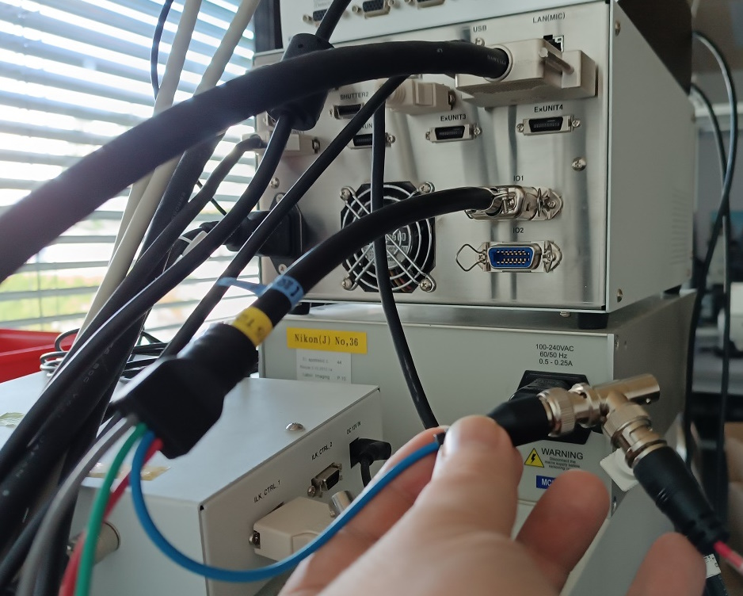

[\[Table of Contents\]](README.md)

# 1. Setup Nikon Ti2 microscope and NIS-Elements software for Wellplate applications - "Preview/Overview Objective + Z-Reference"

This is a setup for limited wellplate use when you do not need (or do not want) to use AI functions for automatic overview of the wellplate (automatic finding cells, automatic finding the first well with the cells for auto focusing, etc.).
    
AI functions has been trained for these cell lines:

**A431, BSC-1, CHOK1, Cos7, HeLa, HepG2, HT29, J774.1, Neuro2a, iPSC derived Neurons**.  
  
If you use something else than the above mentioned cell lines or completely different samples (tissue) then Cells.ai Autofocus and CellPresence.ai detection might fail.

If you do not have the special condenser ring even for 4x objective then wellplate detection might fail as well as the AI functions mentioned above.

## 1.1 Setup Nikon Ti2

It is very important to correctly setup the hw (microscope, camera) in order to produce reasonable image in NIS-Elements.

**Microscope used for testing**
- Nikon ECLIPSE Ti2-E
- Motorized stage (Ti2-S-SE-E, Ti2-S-SS-E)
- LED Lamphouse for dia illumination (Ti2-D-LHLED) + ND32 filter
- Objective lenses:
  - PLAN APO λD 4x OFN25 (MRD70040)
  - PLAN APO λD 10x OFN25 DIC N1 (MRD70170)
  - PLAN APO λD 20x OFN25 DIC N2 (MRD70270)
  - Plan Fluor 40x DIC M N2 (MRH00401) - NA = 0.75 objective lens used for testing
  - Motorized condenser turret (Ti2-C-TC-E) + TI-C-LWD or TI-C-ELWD   

**Tested Cameras**
- Hamamatsu Fusion
- Photometrics Prime 95B
- Photometrics Prime BSI
 
**Tested Wellplates types**
- 6/12/24/48/96/384 wells with glass, film and plastic bottoms

### 1.1.1 Condenser rings setup

Insert the rings into the condenser and mount the condenser to the microscope.

> [!IMPORTANT]  
> The condenser turret itself has to be correctly focused. The focusing should be ideally performed on the typical sample/wellplate which will be acquired on the system.

### 1.1.2 Camera trigger cable

It is necessary to for a correct working of continuous XY scanning to connect camera with Ti2 microscope by triggering cable:
- Camera side - the wiring of course depends on the camera manufacturer and model, but generally the pin marked as "Trigger In" should be used
- Ti2 side - use I/O port on the controller and Nikon's triggering cable, use for example blue pin - which one you use has to be setup in the software Ti2 configuration, see [2.1 Triggering Setup](#21-triggering-setup)

## 1.2. NIS-Elements software

### 1.2.1 Triggering Setup

The correct pin for the triggering cable connected in [1.2 Camera trigger cable](#12-camera-trigger-cable) has to be defined in Ti2 configuration:
- open Configuration dialog from Ti2 Pad
- go to I/O tab
- define "Trigger Camera" to the appropriate pin

### 1.2.2 Setup the software - Service Settings

The most of the setup will be done in the Service Settings dialog. It is available for any user who has assigned the privilege "Ji/Ti service settings" in User Manager.

- Choose the "Preview/Overview Objective + Z-Reference" option in the top part of the dialog to make available usage of limited number of features.

    

- Here, you can see the status of the camera triggering setup above ([1.2 Camera trigger cable](#12-camera-trigger-cable), [2.1 Triggering Setup](#21-triggering-setup)) and you can even test if it works by pressing "Test Connection" button.

#### 1.2.2.1 Camera tab

- Acquisition
 
    It is necessary to set brightness settings (camera exposure, light power, condenser position) for 4x objective.  
      

    To modify the default settings you need to press "Edit" button to activate the buttons "Values to Config." and "Values to System".  
    - Run "Live" and configure brightfield illumination, camera exposure and condenser.
    - Press button "Values to Config." to assign the current values to the system configuration which is used for automatic scanning and wellplate detection.`

    Note: Button "Values to System" always replace the current values by the latest saved settings. 

    > [!IMPORTANT]  
    > It is important for the continuous XY scanning that the camera exposure is less then 800µs. The shorter exposure times, the faster Auto Focus.  
    > Please try to set the exposure accordingly for 4x objective.
    >
    > The most problematic setting is for transparent plastic wellplates. If you do not have the special condenser ring for 4x objective it can be necessary to setup Aperture Stop on microscope manually for a correct working of wellplate detection functionality in [Sample Navigation Control Panel](sample_navigation.md).
    >
    > The most sensitive is the setting for 4x Closed aperture configuration as it is used by built-in functions in Sample Navigation control panel (plate detection, cell presence, Cells.ai Autofocus).
    >
    > Try to find out a **best common setting** for all plate types used in your lab. Different types like 96 vs 384, dry wells vs wells filled by buffer etc. behaves very differently.  
    >
    > It is very important not to acquire oversaturated images by the settings as those negatively affect the software functions.  
    

- Brightfield lightpath
   
    Setting of the positions of turret and emission filter wheel which will be used for brightfield acquisition.

    

#### 1.2.2.2 Microscope Z Limits

- Objective Parfocalities
   
   The parfocalities are defined in Ti-2 Tools utility and here they are only displayed - editing is disabled.  
     

   The parfocalities usage in the application is quite limited, currently there is just one place where it is applied. With "Allow Parfocal Correction" in Ti2 configuration, the offset is automatically applied after exchanging objectives.  
    
    
- Stage Z Navigation

    Microscope Z-limits have to be calibrated. It is necessary to have the slide holder/subholder (TI2-S-HU, Universal Holder or TI2-S-HW + C-S-HU or ATX-CSG) for this procedure.  
    The Z calibration is a **MUST**, otherwise you cannot see the "Wellplate" tab in Sample Navigation but only the "Stage" tab.  
    - Make sure you have one of those holders/subholder (menioned above) on the stage and also some sample slide.  
     
    
    -  Press the button "Calibrate Z..." and the Calibration dialog is displayed.  
    - Select the slide holder/subholder you have currently on the stage and press "Next".  
    

    - Run "Live" and focus on the sample (either by pressing "Auto Focus" button or manually). All other Z positions are automatically calculated.  
    

    - Press "Finish" button. The settings are stored and you are back in the main "Service Settings" dialog window.
    > [!NOTE]
    > The Z positions for other holders are automatically recalculated although this procedure is based just on the slide holder.

    Now, you can change the holder to the wellplate holder by pressing the button "Select Holder".   
    Once you change it, you can see the Z position are re-calculated an "Focus Position" value is "N/A" - this is by purpose. It can be defined / re-defined anytime in the Sample Navigation Control panel because it is different for each plate depending on its skirt height. 

- Global Limit

    "Top position for 4x objective" is used as the top limit of full range Autofocus used for focusing on the first well with cells during Overview scanning on Sample Navigation control panel.

    > [!IMPORTANT]  
    > The default is set to 8000 since version 6.10.01. It was lower in older versions, but it caused unreachable focus on some wellplates with very high skirt.

#### 1.2.2.3 Assays Objectives  

   
   
   - Objective for scanning overview - there can be selected 4x objective only.  

   - Parfocality Limits between channels - the maximal allowed Z-offset between channels found by "Auto All" or "Find Automatically" functions .  
    
     
## Finished! You are good to go.

For more information how to effectively use Stage Navigation, wellplate navigation, labelling, dosing, acquisition, etc., please see the document ["Sample Navigation Control Panel usage"](sample_navigation.md)

[\[Top\]](#1-setup-nikon-ti2-microscope-and-nis-elements-software-for-wellplate-applications---no-overview) [\[Table of Contents\]](README.md)