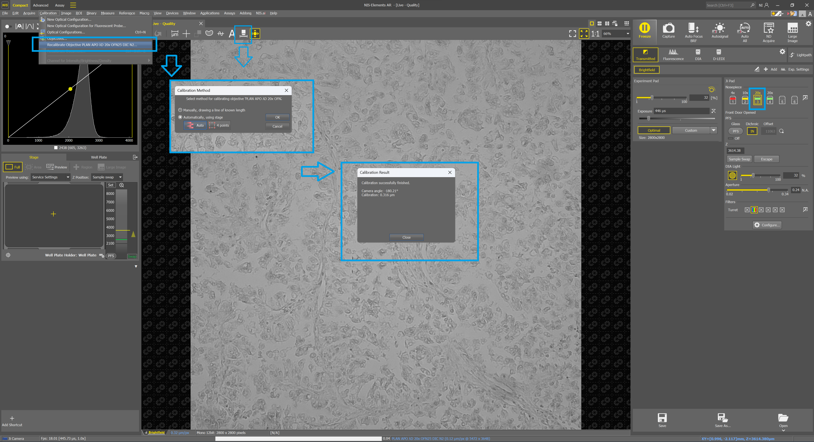
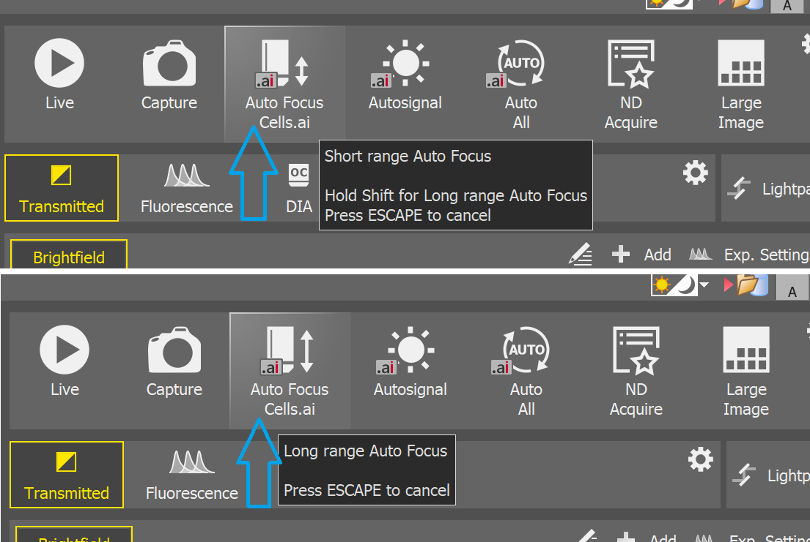
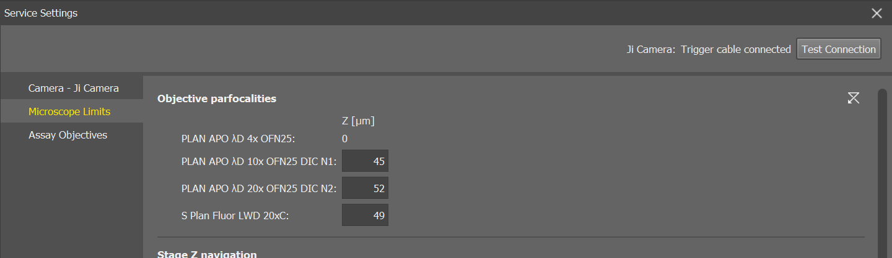

<!-- start print pdf

[NIS_and_Ji_Microscope_FAQ]: https://lim.cz/getfile/NIS_and_Ji_Microscope_-_FAQ--en-6.10.01.pdf
[NIS_and_Ji_Microscope_Setup]: https://lim.cz/getfile/NIS_and_Ji_Microscope_-_Setup--en-6.10.01.pdf
 end print pdf -->

NIS-Elements v6.20.xx (LO) and Nikon Eclipse Ji Digital Microscope Setup
==========================================================
# Introduction and General Information 

This document is a guide to setup __Ji microscope and NIS-Elements version 6.20.00 (build 2057) Local Option__ and later versions.  

The document contains information what to check / setup in Device Manager and Service Settings in NIS-Elements.  

The most important setup steps are highlighted in this document to get the maximum from the system and fully working. 

List of the versions to be checked:
| NAME        | VERSION                 | TYPE          |
| ----------- | :----------------------:| ------------- |
|Eclipse Ji   | v1.10                   | Firmware      |
|D-LEDI       | v3.40                   | Firmware      |
|JiTool       | v1.3.0.54               | Software      |
|NIS-Elements | 6.20.xx LO              | Software      |

<!-- gitpages You can also check [FAQ](FAQ.md) section if you just search for some answers.-->
You can also check [Hints and Tips](#2-hints-and-tips) if you just search for some answers.

<!---  
`This document is going to be updated soon.`  
`There is a plan to get new functions for NIS-Elements in the near future and for example:`  
`-  Reference Z will be defined in NIS-Elements instead of Ji-Tools,`  
`-  Parfocality and parcentricity will be automatically synchronized between NIS-Elements and Ji-Tool, `  
`-  easier handling of the objectives Z-limits instead of workaround mentioned in this document now.`  
-->

> [!NOTE]
> - **This document has been created by Laboratory Imaging s.r.o.**
> - **This document does not contain the section for updating Ji firmware nor D-LEDI firmware.**  
> - **This document does not replace the documents created by Nikon.**

  
  
  ---------------------------------------------------------  
 
> [!IMPORTANT]  
> 1. It is recommended to switch off (at least temporarily) all antivirus applications (they can block some of the files) during the installation.
> 2. __Ji Tool__ application installation is necessary __only for the first initialization__ when you connect Ji body to the controller for the first time.   
> 3. You do not need to use Ji Tool application anymore after the first initialization mentioned in the point 2. above. 

Content of the NIS-Elements installation and setup:
- [NIS-Elements v6.20.xx (LO) and Nikon Eclipse Ji Digital Microscope Setup](#nis-elements-v620xx-lo-and-nikon-eclipse-ji-digital-microscope-setup)
- [Introduction and General Information](#introduction-and-general-information)
  - [1. The First Initialization](#1-the-first-initialization)
  - [2.   NIS-Elements Setup](#2---nis-elements-setup)
    - [2.1 Installation of NIS-Elements](#21-installation-of-nis-elements)
    - [2.2 Device Manager](#22-device-manager)
    - [2.3 Objectives and filter cube assignment](#23-objectives-and-filter-cube-assignment)
    - [2.4 Objective Calibration](#24-objective-calibration)
    - [2.5 Service Settings](#25-service-settings)
      - [2.5.1 Select the tab "Camera - Ji Camera"](#251-select-the-tab-camera---ji-camera)
      - [2.5.2 Select "Microscope Limits" tab](#252-select-microscope-limits-tab)
        - [2.5.2.1  Objective Parfocalities](#2521--objective-parfocalities)
        - [2.5.2.2 Stage Z Navigation](#2522-stage-z-navigation)
      - [2.5.3 Select "Assay Objectives" tab](#253-select-assay-objectives-tab)
    - [2.6 User Rights](#26-user-rights)
  - [3 Hints and Tips](#3-hints-and-tips)
    - [3.1 Ji-Tools application](#31-ji-tools-application)
    - [3.2 Auto Focus Ranges](#32-auto-focus-ranges)
    - [3.3 How to make scanning overview faster in NIS-Elements?](#33-how-to-make-scanning-overview-faster-in-nis-elements)
    - [3.4 How to change Exposure, Aperture and illumination in Service Settings?](#34-how-to-change-exposure-aperture-and-illumination-in-service-settings)
    - [3.5 How to set objectives parfocalities in NIS-Elements?](#35-how-to-set-objectives-parfocalities-in-nis-elements)
    - [3.6 How to set objective parcentricities in NIS-Elements?](#36-how-to-set-objective-parcentricities-in-nis-elements)
    - [3.7 Water Immersion Dispenser (WID) and Stage-up Kit](#37-water-immersion-dispenser-wid-and-stage-up-kit)

## 1. The First Initialization
This step is necessary if Ji microscope has not ever been used with the current controller.  
__Do not switch Ji microscope on until Ji Tool application is installed.__  

1. Install Ji-Tool application.    
"c:\Program Files\NIS-Elements\Drivers\Ji\JiTool\JiTool_1.3.0.54.msi"   
2. Switch Ji microscope on.  
3. Run Ji Tool.  
4. Close Ji Tool.  

The first initialization is complete.
    
## 2.   NIS-Elements Setup

### 2.1 Installation of NIS-Elements

Install version NIS-Elements version 6.20.00 (build 2057) LO under the administrator's rights.

1. Run NIS-Elements installation setup version NIS-Elements version 6.20.00 (build 2057).  
2. Check the NIS-Elements version and press "Next".
3. Accept the license agreement and press "Next".    
4. Check the "Advanced Research" and "Local Option" checkboxes and press "Next".  
5. You do not need to select any camera in "Cameras" dialog and press "Next".
6. Select "Smart Experiment" in the "Modules" dialog and  press "Next".
7. Select "Nikon" on the left and select "Nikon Ji" on the right in the "Devices" dialog and press "Next".
    - Progress dialog is displayed. Wait until you see the installation is complete.
    - It is recommended to select "Initialize NIS.ai Networks" when the " First Initialization of NIS.ai Networks" dialog appears(it takes minutes).  
        - Otherwise, the AI networks will be initialized during NIS-Elements runtime on demand when it is being used for the first time.  
8. Press "Finish" when the final dialog appears after successful installation.  

<!--
#### 2.1.2 Apply the Patch01  

1. Download and Install "Wellplate Scanning Patch01" - see download link below:
  - https://downloads.laboratory-imaging.com/NIS/6.0x/Wellplate_Scanning_Patch_01_for_NIS_6.10.01_b2027.exe
2. Run the "exe" installation file.  
3. The first dialog displays the detected NIS-Elements application folder where the patch will be applied. Confirm and press "Next".
4. When the patch installation is complete, press "Finish".

#### 2.1.3 Registry Key

There is necessary to change one value in the registry key.  

1. Please download this ZIP file here:  
    - https://downloads.laboratory-imaging.com/NIS/6.0x/Ji/Ji_NIS_Z-limit.zip  
        - ZIP file contains the registry key values for NIS-Elements regarding Ji values.  
2. Unzip the file  
3. Run the registry key (mouse double-click) - file name "Ji_NIS_Z-limit.reg"  
    - The confirmation dialog is displayed after a successful adding the registry value.  
  
  

4. Run "NIS-Elements" and follow the next steps.
-->

### 2.2 Device Manager

Run "NIS-Elements" and follow the next steps.

Device Manager window appears automatically if you run the application for the first time without any connected device.  
Anyway, you can always go to "Devices" in the top main menu and select "Device Manager" in Advanced Layout. 

1. Press "Select Microscope" button.
2. Select "Nikon Ji" and confirm selection by pressing "Create Setup" button.
3. Confirm Nikon D-LEDI Configuration dialog by pressing "OK" button.
4. Check the Ji microscope schematic view in Device Manager dialog and press "Close" button.

<!--
> [!IMPORTANT]  
> NIS-Elements automatically reads all the values from the Ji microscope previously setup in Ji-Tool.  
> - Check the Ji Pad in NIS-Elements that all the nosepiece positions and filter turret positions are assigned properly with the objectives and filter cubes.  
> - If you need to change some Ji microscope settings mentioned above you can do it in NIS-Elements (you do not have to run Ji-Tool again).  
-->

### 2.3 Objectives and filter cube assignment

Assign the proper objectives and filter cube.

Go to Ji Pad and assign:
1. Objectives
    - Plan APO λD 4X (MRD70040) on the 1st position
    - Plan APO λD 10X (MRD70170) on the 2nd position
    - Plan Apo λD 20X (MRD70270) on the 3rd position
    - S Plan Fluor 20X (MRH08250) on the 4h position <!-- MIREK-dotaz: ano/ne?-->
2. Filter Cube
    -  Leave "Empty" on the 1st position
    -  C-FC-Q Quad band FL filter cube 378/474/554/635 (Assay-QB1) on the 2nd position
  

### 2.4 Objective Calibration

Put some sample on the stage either wellplate into wellplate holder or some slide into slide subholder.  
> [!IMPORTANT]  
> - Use some sample with irregular structure.
> - Do not use a sample with repeated or regular pattern (e.g. calibration slide).

Once the sample is placed on the stage:
1. Select an objective for calibration on Ji Pad and run Live image.
2. Focus on the sample (manually or using Auto Focus function).
3. Adjust the illumination (manually or using AutoSignal function).
4. Check LUTs and/or AutoLUTs - it must be switched off before calibration process starts.
5. Go to the main menu "Calibration" and select "Recalibrate Objective %objectivename% ..."
      - Or you can also press the "Auto Calibrate" on top image toolbar on Live image.
6. In the "Calibration Method" dialog select "Automatically, using stage" and the button "Auto" and press "OK" button.
    - Calibration procedure automatically moves the stage in XY directions and calibrate the objective and detects the camera angle.
7. Repeat the steps above for each of the assigned objectives. 

### 2.5 Service Settings

<!--
It is necessary to change camera ROI displacement from the default values to zero. Other default values in the Service Settings dialog are correctly preset for many standard use cases - Smart Experiment.  
There is no need for any additional adjustment to use the whole system.
Anyway, there is the description below if you wish to adjust or fine tune some settings for a specific use case.
-->

Go to main menu "Devices" and select "Service Settings"

#### 2.5.1 Select the tab "Camera - Ji Camera"
1.  Set "Offset center X" and "Offset center Y" to 0 (zero) for Optimal ROI as well as Large ROI"

2. Set proper brightfield Acqusition settings (Exposure, Light Power) for each of the objectives  
    - run "Live" and press "Edit" button,  
    - select an objective,  
    - adjust the Exposure and Light power,  
    - press the button "Values to Config." to store the current settings as your Acquisition Settings for brightfield.
  
  

   - Repeat these steps for each of the assigned objectives.

#### 2.5.2 Select "Microscope Limits" tab  

<!-- gitpages you can set relative Z-offset for each objective if you plan to use automatic parfocality compensation in the ["Objective Parfocalities" section](FAQ.md#6-how-to-set-objectives-parfocalities-in-nis-elements)-->  

##### 2.5.2.1  Objective Parfocalities  
- input the value of the relative Z-offset of each objective for using automatic parfocality compensation.  
  
##### 2.5.2.2 Stage Z Navigation  

In the version 6.20.00 you can use also wellplate to calibrate Z (not only slide like in the previous versions) but you need to know WBE parameter (well bottom elevation).

1. Press the button "Recalibrate Z",  
2. select the proper holder (and subholder),  
3. find the focus plane of your sample,
   - input WBE value if you use a wellplate,  
4. press the button "Finish".

 

> [!TIP]
> - Holder (and subholder) can be changed anytime when you click the "Select Holder" button either here in Service Settings or in Sample Navigation control panel.
> - In "XYZ SW Limits" section, you can check the maximal allowed Z position for each of the objectives. This is always limited by the objective's dimensions, working distance and the adjacent objectives to prevent hitting the stage / holder.  
  
#### 2.5.3 Select "Assay Objectives" tab

1. Assay Objectives  
- Check the assigned objectives for Assays,   
- Adjust the selection if needed.  
 
2. Distance Offset from the Focal Plane to Analysis Plane for BF
- Adjust these parameters if Autofocus function with Cells.ai criterion does not select the proper focal plane with cells.
- This is used not only for Smart Experiment but also for other autofocusing with Cells.ai criterion (Sample Navigation - Wellplate, AF button on the Acquisition pad, etc.).

### 2.6 User Rights

This User rights chapter is mandatory for Smart Experiment only.

The most important is to make clear who is allowed to:
1. open and change Ji Service settings - "Ji/Ti Service Settings" privilege,
2. adjust the assays parameters - "Assay Admin", 
3. handle/adjust the users and their rights - "Modify user rights".

 
 

___SETUP COMPLETED. You can run Smart Experiment.___ 

## 3 Hints and Tips

### 3.1 Ji-Tools application

If you want to install Ji-Tools application you can find the installation file in the  NIS-Elements application folder. By default the location is:

c:\Program Files\NIS-Elements\Drivers\Ji\JiTool\

### 3.2 Auto Focus Ranges

AF with Ji - ranges (short/long)  

4x obj. - 600 um / 3000 um  
10x obj. - 200 um / 500 um  
20x obj. - 200 um / 400 um  

Those ranges are relative ranges from the current Z position.  

> [!NOTE]  
> - There is one EXCEPTION where the range is always given and always the same (no matter what is the current Z position):
> 
>   - __4x objective + Brightfield + AF Long + Cells.ai criterion__  
> 
>     - The range is always __from 2525um to 7000 um.__ 
> 

### 3.3 How to make scanning overview faster in NIS-Elements?

If the stage does not scan overview using stage continuous movement (=scanning the tiles step by step), check the camera exposure and illumination Service Settings.

- Go to main menu "Devices" -> "Service Settings".
- Select "Camera - Ji Camera".  
 - Press the "Edit" button.   
     - the buttons "Values to Config." and "Values to System" become enabled.  
 - Select the required overview 4x objective.
 - Set lower exposure time and enhance illumination for "Closed Aperture Brightfield".
    - Recommended exposure is to be set under 800 us (0.8 ms).
 - Define desired exposure value on "Ji Pad".   
 - Press the button "Values to Config."
 - Press the button "Edit".  
 - Press the button "OK" to close the Service Settings dialog.
 

### 3.4 How to change Exposure, Aperture and illumination in Service Settings?

Sometimes it is necessary to adjust the settings used for wellplate detection, overview scanning, cells detection or cells.ai autofocus.

 - Go to main menu "Devices" -> "Service Settings".  
 - Select "Camera - Ji Camera".  
 - Press the "Edit" button.   
     - the buttons "Values to Config." and "Values to System" become enabled.  
 - Select the required objective.  
 - Run Live image.  
 - Adjust "Exposure" on the Ji camera pad and "Light Power" on the microscope pad.  
 - Press "Values to Config" and confirm the change.  
You can repeat this procedure for all the objectives.  
For 4x objective you can adjust the settings for closed and opened aperture.  

> [!NOTE]
> When adjusting the settings for 4x objective:
>   - "Closed Aperture Brightfield" is used for wellplate detection, focusing and confluency,  
>   - "Opened Aperture Brightfield" is used for wellplate scanning from Sample Navigation - Wellplate tab - button "Scan".  
  

### 3.5 How to set objectives parfocalities in NIS-Elements?

To setup the parfocalities is usefull mainly for interactive work on Live image when changing the objectives.

- Put some sample the stage.  
- Enhance the illumination and focus on the sample with each of the objectives.
    - Note the focused Z value for each of the objectives. 
- Go to main menu "Devices" -> "Service Settings".  
- Select the "Microscope Limits" tab.  
- Input the measured difference between the objectives on the sample in focus where 4x objective is the reference position.  

- Close the "Service Settings" dialog.  
- Go to "Ji pad" and press the "Configure" button.  
- Select the "Z" tab.  
- Check the "Apply Parfocality Offset on Objective Change" checkbox.  
- Press the "OK" button.  
    - Text indication is displayed on the "Ji Pad".

### 3.6 How to set objective parcentricities in NIS-Elements?

To setup the parcentrities is usefull mainly for interactive work on Live image when changing the objectives.

- Put some sample the stage.  
- Enhance the illumination and focus on the sample.  
- Go to the main menu "Devices" and select "Objective XY Offset Setup..."

- Define XY offsets between the objective combinations

- Close this dialog
- Go to "Ji pad" and press the "Configure" button.  
- Select the "XY" tab.  
- Check the "Apply Parcentricity Offset on Objective Change" checkbox.  
- Press the "OK" button.  
    - Text indication is displayed on the "Ji Pad".

  

### 3.7 Water Immersion Dispenser (WID) and Stage-up Kit

If you use WID you have installed also stage-up kit. This means that your sample is automatically __2.5 mm higher__ (this is the height of the stage-up kit accessories).  

- Make sure, you used "Calibrate Z" in the Service Settings after the stage-up kit is in its place (not before, otherwise you need to recalibrate it).

- It is recommended to run "Measure Precise Electrical Sensor Position" to get up to +300um in Z range (by default it is 9700um instead of 10000um, for safety reasons).   

  

> [!TIP]
> - Objective's Z range is limited based on the adjacent objective (for the safety reasons).  
> - Example: 
>   - In case you have some empty nosepiece positions you can assign 4x objective to the 1st nosepiece position, 10x objective to the 2nd nosepiece position, 20x objective assign to the 3rd position, 4th position leave empty, and another 20x objective assign to the 5th position.  
>   - The 20x objectives will be less limited in the Z-range.  

<!-- ### 2.6 Windows Registry Key
It is also <b>necessary to change one Windows registry key</b>.

How to run Windows Registry Editor and change it:
- Press the Windows "Start" button  and start typing "Registry Editor" and it will appear as an application choice  
- Press "Run as administrator" and confirm.   

  

- In Registry Editor, go to Computer\HKEY_LOCAL_MACHINE\SOFTWARE\Laboratory Imaging\Misc\Ji  
- Find the key named "CollisionPrevensionBehavior_0_ForceDisabled__1_ForceEnabled__2_Automatic" and click on it by right mouse button  

  

- Select "Modify" on the context menu  
- In the "Edit DWORD" dialog change the "Value Data" to [0] and click "OK" button  

- Close the "Registry Editor" dialog by clicking on [X]
 
- <b>!!! klic se vytvari az na connect JI - zkusit jestli bez admin rights lze spustis hotovy regkey + dodelat screenshoty instalace</b> 
-->

<!-- 
# Wellplate applications on Ti2 microscope

> [!IMPORTANT]
> All the information below is related to **NIS-Elements version 6.10.01 + Patch 01** or newer.

## Sample Navigation features

| Feature                                                  | Hw requirements                                         | Minimal setup type                                                               |
| -------------------------------------------------------- | ------------------------------------------------------- | -------------------------------------------------------------------------------- |
| Automatic Wellplate type detection only                  | No special requirements                                 | ["Preview/Overview Objective + Z-Reference"](system_setup_overview_objective.md) |
| Automatic Wellplate type detection + *Overview functions | **Special condenser rings **at least for 4x objective** | ["Preview/Overview Objective + Z-Reference"](system_setup_overview_objective.md) |
| Full set of functions                                    | **Special condenser rings for all objectives            | ["Full"](system_setup_full.md)                                                   |

*Overview functions:
- Cell presence detection (CellPresence.ai), it is used for finding a place where to start the first Autofocus as well as for marking wells by "Cells present" label
- AI based Fast Autofocus (Cells.ai)

**Special condenser rings:
- [ELWD condenser](LW_AS_ELWD.md)
- [LWD condenser](LW_AS_LWD.md)

## Sample Navigation setups

There are three different setup types depending on the special condenser rings and used samples.

#### 1. I have a set of the special condenser rings for ELWD ([LW_AS_ELWD](LW_AS_ELWD.md)) or LWD ([LW_AS_LWD](LW_AS_LWD.md)) condenser and I am using wellplates with [one of the trained cell lines](#ai-functions-has-been-trained-for-these-cell-lines)
   - [Use **"Full" setup**](system_setup_full.md), it provides full functionality for Wellplate application, see the functions above.
         
#### 2. I **do not have** the full set of the special condenser rings, but I have just the rings for 4x objective which is used for plate detection and scanning overview     
   - [Use **"Preview/Overview Objective + Z-Reference" setup**](system_setup_overview_objective.md), a setup where Wellplate type detection works, but scanning Overview can fail due to Cells.ai or CellPresence.ai do not work correctly.  
  
#### 3. I do not have any special condenser ring
   - [Use **"Preview/Overview Objective + Z-Reference" setup**](system_setup_overview_objective.md), a setup where Wellplate type detection works for the most of wellplates, but scanning Overview can fail due to Cells.ai or CellPresence.ai do not work correctly.  
   - Use **"Z-Reference Only setup"** in case you are not able to set the system correctly even for wellplate type detection - 4x objective closed condenser ring or manual Aperture Stop setting. In case of this setup the Well Plate tab will not be present in ["Sample Navigation Control Panel usage"](sample_navigation.md).

### AI functions has been trained for these cell lines:  

> A431  
> BSC-1  
> CHOK1  
> Cos7  
> HeLa  
> HepG2  
> HT29  
> J774.1  
> Neuro2a  
> iPSC derived Neurons

# Other documents

A. [Sample Navigation Control Panel usage.](sample_navigation.md)

B. [How to use the built-in functions in your custom Jobs.](jobtasks_usage.md)

-->
<link rel="stylesheet" href="./print.css"  media="print">